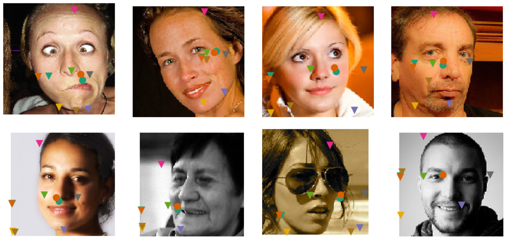
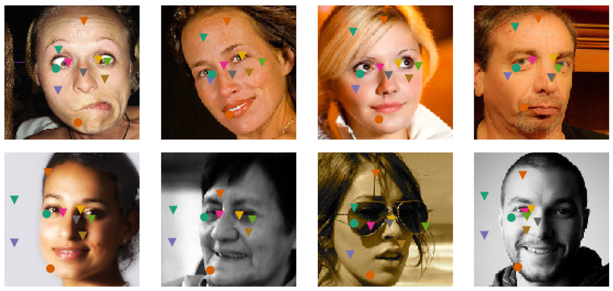

# [Unsupervised Learning of Object Landmarks through Conditional Image Generation]
Group member: 吴宇恒，徐诚伟，张凯忻

## Requirements
* Linux
* Python 2.7
* TensorFlow 1.10.0.
* Torch 0.4.1
* CUDA cuDNN.
* Python dependecies listed in `requirements.txt`

## Experiment results
We have trained the model on our own machine for two times, with 300 and 3000 epoch respectively.
The result for 300 epoch:

The result for 3000 epoch:

